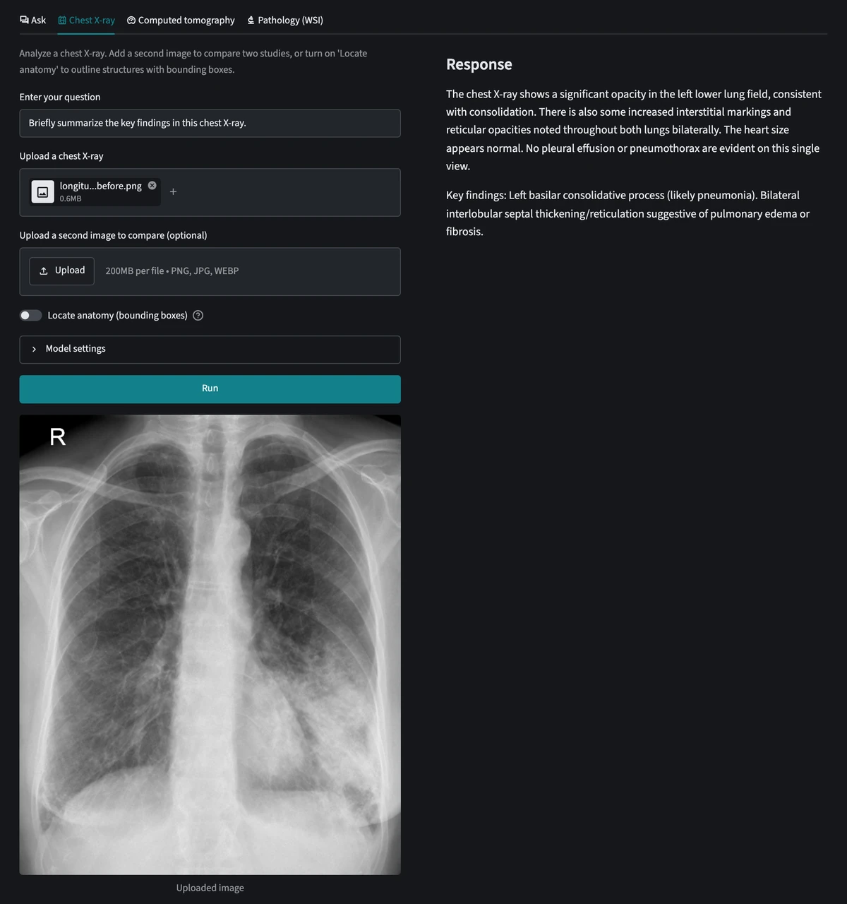

# MedGemma Studio

[](https://github.com/darylalim/medgemma-studio/actions/workflows/ci.yml) [](https://github.com/darylalim/medgemma-studio/releases) [](LICENSE)

Streamlit application for analyzing medical text and images using Google [MedGemma](https://huggingface.co/mlx-community/medgemma-1.5-4b-it-8bit) on Apple Silicon with MLX. Inference runs entirely on-device — no image, scan, or slide ever leaves your Mac.



## Disclaimer

> [!WARNING]
> **Research and educational use only — not a medical device.** MedGemma Studio is not for clinical use, diagnosis, or treatment. Its AI-generated outputs may be inaccurate and are not medical advice; always consult a qualified healthcare professional.

Using MedGemma through this app is subject to Google's [Health AI Developer Foundations Terms of Use](https://developers.google.com/health-ai-developer-foundations/terms), which govern the model separately from this project's [license](#license).

## Features

- Four tabs, each with its own settings (system instruction + thinking toggle, in a collapsible "Model settings" panel):
  - **Ask** — text-only medical Q&A
  - **Chest X-ray** — analyze one image, compare two studies side by side (longitudinal), or draw labeled anatomy bounding boxes ("Locate anatomy")
  - **Computed tomography** — upload a DICOM series; each slice is windowed into MedGemma's trained false-color (Hounsfield-unit) representation and read as a stack
  - **Pathology (WSI)** — upload a whole-slide image (`.svs`/`.ndpi`/`.tif`/`.tiff`); tissue patches are sampled at a chosen magnification and read as the 896px tiles MedGemma is trained on
- A wide, two-pane workspace in every tab: your question, uploads and settings on the left along with the images the model reads, and its answer on the right, beside them
- The model's answer **streams in live** as it is generated — a blank wait becomes visibly arriving text on a slow local model
- Staged progress feedback while reading a DICOM series or a whole-slide image, before generation begins
- RAM-aware cap on CT slices / WSI patches (multi-image inference is memory-heavy on unified memory), stated in the sidebar next to the memory it was sized for
- Results stay visible across reruns and clear — with a hint — when you change the inputs
- Nord dark theme — a calm, low-glare surround for reading medical images
- Fully local inference on Apple Silicon via MLX — after the one-time model download the app makes **no outbound network requests**: usage telemetry is off, and fonts and the tab icon are served from the app itself

## Setup

Requires:

- Mac with Apple Silicon
- Python 3.12
- [uv](https://docs.astral.sh/uv/)
- **16 GB unified memory** minimum (comfortable for the Ask and Chest X-ray tabs); **24 GB or more** for the Computed tomography and Pathology tabs, whose multi-image inference is memory-heavy, and **32 GB or more recommended** to analyze a useful number of slices at once — the app automatically caps how many CT slices / WSI patches it analyzes to fit your RAM (2 below 22 GB, 6 at 24 GB, 20 at 32 GB)
- **~6 GB free disk** for the model weights

The model ([`mlx-community/medgemma-1.5-4b-it-8bit`](https://huggingface.co/mlx-community/medgemma-1.5-4b-it-8bit), ~6 GB) downloads from Hugging Face on first run — an 8-bit MLX quantization of `google/medgemma-1.5-4b-it` that leaves the vision encoder at bf16, so image understanding runs unquantized. The repo is ungated, so no token is required. Whole-slide pathology support needs no extra setup — OpenSlide's native library ships as a prebuilt Apple Silicon wheel (no Homebrew).

```bash
uv sync
```

Optionally, create a `.env` file with a Hugging Face token to avoid download rate limits:

```
HF_TOKEN=your_token_here
```

## Usage

```bash
uv run streamlit run streamlit_app.py
```

The app opens with four tabs, each split into inputs on the left and the model's answer on the right; the sidebar shows the model in use and how many CT slices / WSI patches your Mac's memory allows per run.

- **Ask** — enter a question and run for a text-only answer.
- **Chest X-ray** — upload an image and run for analysis. To **locate anatomy**, enable the toggle and ask e.g. *"Where is the right clavicle?"*; the app draws labeled bounding boxes (this mode uses a built-in prompt and ignores the system instruction). To **compare** two studies, upload a first image, then a second in the slot that appears — the two are previewed side by side and the app sends both in one prompt and describes the changes. (Localization is single-image only and is disabled with two images.)
- **Computed tomography** — upload a CT series as individual DICOM slice files (multi-select; extensionless files such as `IM_0001` are accepted, since per-slice DICOMs off a PACS or study CD often have no extension), choose how many slices to analyze, enter a question, and run. Each slice is windowed into a false-color image before analysis.
- **Pathology (WSI)** — upload a whole-slide image (`.svs`/`.ndpi`/`.tif`/`.tiff`, up to 2 GB), pick a magnification (5/10/20/40×) and how many tissue patches to analyze, enter a question, and run. A tissue-overview overlay (sampled patches outlined) and a sample patch are shown, with the actual magnification disclosed (clamped to the slide's available pyramid levels).

## Try it with sample data

No medical images on hand? [`samples/README.md`](samples/README.md) has copy-paste download commands — with source attribution — for a real longitudinal chest X-ray pair, a CT DICOM series, and a whole-slide image (the same public assets used in Google's MedGemma notebooks), plus step-by-step instructions for exercising each tab. The files are gitignored; only that guide is tracked.

## Development

```bash
uv run ruff check .               # Lint
uv run ruff format .              # Format
uv run ty check                   # Type check
uv run pytest                     # Run tests
```

Linting uses a curated ruff rule set (`E`, `F`, `I`, `UP`, `B`, `SIM`, `C4`); see `[tool.ruff.lint]` in `pyproject.toml`.

Every push to `main` and every pull request runs these same four gates on GitHub Actions ([`.github/workflows/ci.yml`](.github/workflows/ci.yml)) on an Apple-Silicon runner — the CI badge above reflects the latest run. The workflow's `uv sync --locked` step also fails if `uv.lock` has drifted from `pyproject.toml`.

Releases are cut automatically. Bumping `version` in `pyproject.toml` (with `uv lock`) and pushing to `main` is the whole flow: once CI passes, [`.github/workflows/tag-and-release.yml`](.github/workflows/tag-and-release.yml) creates the `vX.Y.Z` tag and publishes the release — not a draft — with notes generated from the commit history (there is no hand-maintained changelog). It waits on CI deliberately, so a bump that breaks a gate or forgets `uv lock` never ships, and it keys off whether that version already has a release, so re-runs are harmless. Hand-pushing a `vX.Y.Z` tag still works and takes the older path, [`.github/workflows/release.yml`](.github/workflows/release.yml), which verifies the tag matches the `pyproject.toml` version and now skips quietly if that release already exists. Published releases appear on the [Releases page](https://github.com/darylalim/medgemma-studio/releases).

If you use [Claude Code](https://claude.com/claude-code) in this repo, `.claude/settings.json` wires the commands above into hooks: edited Python files are linted and auto-formatted (`ruff`; `ty` is CI-only), the test suite runs when Claude finishes a turn that touched code or config (docs/chat turns are skipped), and writes to `.env`/`.streamlit/secrets.toml`/`uv.lock` are blocked. The `.claude/settings.json` config is itself guarded by `TestHooksConfig` — as are the repo's other checked-in assets (the theme, the CI and the two release workflows, and this project's `CLAUDE.md`) via `TestThemeConfig` / `TestCiWorkflow` / `TestReleaseWorkflow` / `TestAutoReleaseWorkflow` / `TestClaudeMd`, so a config or doc that drifts from the code fails a test.

**Regenerating the screenshot.** The README hero (`docs/screenshot.webp`) is a headless [Playwright](https://playwright.dev/python/) capture of the **Chest X-ray** tab analyzing the [sample radiograph](samples/README.md) — Playwright runs ephemerally (`uv run --with playwright …`), so it is **not** a project dependency. Drive the tab (attach the sample, ask a plain-analysis question, Run, wait for the response), force the browser to `color_scheme="dark"`, and use a viewport taller than the whole app so Streamlit's inner scroll doesn't clip the capture; then crop to the tab's two-column workspace (the question, upload and radiograph beside the response), downscale, and save as WebP (far smaller than PNG for a photographic radiograph). The throwaway full-page intermediate (`docs/screenshot-full.png`) is gitignored; see `CLAUDE.md` for the exact gotchas.

## License

This project's source code is licensed under the [Apache License 2.0](LICENSE) (`Apache-2.0`).

The MedGemma model is **not** covered by that license. It is distributed under Google's [Health AI Developer Foundations Terms of Use](https://developers.google.com/health-ai-developer-foundations/terms) and downloads separately from Hugging Face at runtime; your use of the model is governed by those terms.
